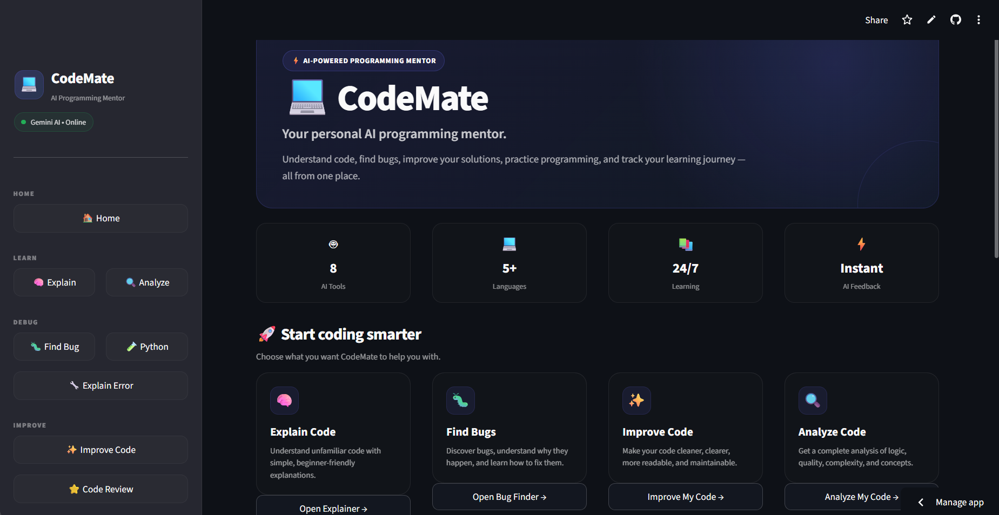

<div align="center">

# 💻 CodeMate

### 🤖 Your AI-Powered Programming Mentor

**Understand • Debug • Analyze • Improve • Practice**

<br>

[](https://codemate-34bpt8avhuvv7odcdqpd3k.streamlit.app/)
[](https://www.python.org/)
[](https://streamlit.io/)
[](https://ai.google.dev/)

<br>

[🚀 Live Demo](https://codemate-34bpt8avhuvv7odcdqpd3k.streamlit.app/)
  •  
[✨ Features](#-features)
  •  
[📸 Screenshots](#-screenshots)
  •  
[🛠️ Tech Stack](#️-tech-stack)
  •  
[⚙️ Installation](#️-installation)
  •  
[👩‍💻 Author](#-author)

</div>

---

# 🌟 About CodeMate

**CodeMate** is an AI-powered programming learning platform built with **Python, Streamlit, and Google Gemini**.

It is designed to help students and developers understand programming concepts instead of simply copying solutions.

CodeMate brings multiple AI-powered programming tools together in one place:

> 💡 **Understand your code. Find your bugs. Improve your skills.**

Whether you're stuck on an error, trying to understand unfamiliar code, improving a solution, or practicing programming problems, CodeMate acts as your **AI-powered coding mentor**.

---

# 🚀 Live Application

<div align="center">

### 🔥 Try CodeMate

<a href="https://codemate-34bpt8avhuvv7odcdqpd3k.streamlit.app/">


</a>

<br><br>

**🌐 Live App:**
https://codemate-34bpt8avhuvv7odcdqpd3k.streamlit.app/

</div>

---

# 🧭 Application Navigation

CodeMate is organized into multiple learning-focused sections:

| Tab                    | Purpose                                    |
| ---------------------- | ------------------------------------------ |
| 🏠 **Home**            | Introduction and CodeMate overview         |
| 🧠 **Explain Code**    | Understand code step-by-step               |
| 🐛 **Find Bug**        | Detect and understand programming bugs     |
| 🔍 **Analyze Code**    | Perform complete code analysis             |
| ✨ **Improve Code**     | Improve readability and efficiency         |
| ⭐ **Code Review**      | Get structured professional-style feedback |
| 🧪 **Syntax Checker**  | Check Python syntax before execution       |
| 🔧 **Error Explainer** | Understand programming errors              |
| 📚 **Practice**        | Generate and solve coding challenges       |
| 📊 **Progress**        | Track learning performance and insights    |

---

# ✨ Features

## 🧠 1. Explain Code

Don't understand a piece of code?

CodeMate breaks it down into understandable explanations.

### It provides:

* 📖 Step-by-step explanation
* 🧩 Programming concepts used
* ⚡ Time complexity
* 💾 Space complexity
* 🐛 Potential issues
* 🎯 Learning recommendations
* 👨‍💻 Beginner-friendly explanations

### Example Workflow

```text
Paste Code
    ↓
Select Experience Level
    ↓
AI Analysis
    ↓
Understand the Logic
    ↓
Learn the Concepts
```

---

## 🐛 2. Find Bug

Debug your program with AI assistance.

CodeMate helps identify:

* 🐛 Potential bugs
* 🔍 Problematic logic
* ⚠️ Edge cases
* 🔧 Possible fixes
* 💡 Debugging techniques

Instead of just showing the answer, CodeMate explains **why the problem occurs**.

---

## 🔍 3. Analyze Code

Get a complete overview of your program.

CodeMate analyzes:

* 🧩 Program logic
* 🐛 Bugs and potential issues
* 📖 Code quality
* ⚡ Time complexity
* 💾 Space complexity
* 🧠 Programming concepts
* 🎯 Topics recommended for further practice

This makes the analyzer useful for both **learning and code improvement**.

---

## ✨ 4. Improve Code

Have working code but want to make it better?

CodeMate provides suggestions for:

* 📖 Readability
* 🏗️ Code structure
* ⚡ Efficiency
* 🧹 Cleaner implementation
* 🔤 Better naming
* ✅ Programming best practices
* 🔧 Maintainability

The goal is to improve the code **without changing its intended functionality**.

---

## ⭐ 5. Professional Code Review

Get structured feedback similar to a real code review.

| Category           | What CodeMate Evaluates                |
| ------------------ | -------------------------------------- |
| 📖 Readability     | Is the code easy to understand?        |
| ⚡ Efficiency       | Can the solution be optimized?         |
| 🏗️ Structure      | Is the code organized properly?        |
| 🏷️ Naming         | Are variables/functions named clearly? |
| 🛡️ Error Handling | Are unexpected cases handled?          |
| ✅ Best Practices   | Does the code follow good practices?   |

### 📊 Review Score

Each review includes an **overall score out of 10**, helping users understand their current coding quality.

---

## 🧪 6. Python Syntax Checker

Before running Python code, CodeMate can check its syntax.

### Detects:

* ❌ Syntax errors
* 📍 Error location
* 📝 Line information
* 🔍 Possible causes
* 💡 Beginner-friendly explanations

This is especially useful for students who are still learning Python.

---

## 🔧 7. Error Explainer

Programming errors can be confusing.

CodeMate converts technical error messages into understandable explanations.

### The AI explains:

```text
🐛 What went wrong
       ↓
🔍 Why it happened
       ↓
🔧 How to fix it
       ↓
✅ Corrected approach
       ↓
💡 How to avoid it
```

---

# 📚 8. AI Practice Mode

CodeMate also works as a programming practice companion.

### 🧩 Available Topics

* Arrays
* Strings
* Loops
* Functions
* Recursion
* Linked Lists
* Stacks
* Queues
* Trees
* Graphs
* Binary Search
* Dynamic Programming

### 🎯 Difficulty Levels

* 🟢 Easy
* 🟡 Medium
* 🔴 Hard

### Practice Flow

```text
Choose Topic
     ↓
Choose Difficulty
     ↓
Generate Problem
     ↓
Write Solution
     ↓
Submit Answer
     ↓
AI Evaluation
     ↓
Receive Score
     ↓
Track Progress
```

---

# 📊 9. Learning Progress Dashboard

CodeMate doesn't stop after solving one problem.

It tracks learning progress over time.

### 📈 Metrics

* 📝 Problems solved
* 📊 Average score
* 🏆 Best score
* 📚 Topics practiced

### 🧠 AI Learning Insights

CodeMate can identify:

* 🏆 Strongest topic
* ⚠️ Topics requiring more practice
* 🎯 Suggested next steps
* 📈 Learning performance trends

### 📊 Visual Analytics

* Score history
* Topic performance
* Difficulty distribution
* Practice progress

---

# 📸 Screenshots & Feature Demos

Get a quick look at the CodeMate interface and its AI-powered programming tools.

---

## 🏠 CodeMate Home

<div align="center">



<br><br>

**🚀 CodeMate — AI-Powered Programming Mentor**

</div>

---

## 🧠 Explain Code

<div align="center">

### ▶️ [Open Explain Code Demo](screenshots/explain.png.mp4)

</div>

See how CodeMate breaks down code into understandable, step-by-step explanations.

**Key capabilities:**

* 📖 Code explanation
* 🧩 Concept identification
* ⚡ Complexity analysis
* 💡 Learning guidance

---

## 🐛 Bug Finder

<div align="center">

### ▶️ [Open Bug Finder Demo](screenshots/bugfind.png.mp4)

</div>

See how CodeMate identifies potential programming bugs and explains why they occur.

**Key capabilities:**

* 🐛 Bug detection
* 🔍 Problem explanation
* 🔧 Fix suggestions
* 💡 Debugging guidance

---

## 🔍 Code Analysis

<div align="center">

### ▶️ [Open Code Analysis Demo](screenshots/analysis.png.mp4)

</div>

See how CodeMate performs a deeper analysis of the submitted code.

**Analysis includes:**

* 🧩 Program logic
* 🐛 Potential issues
* 📖 Code quality
* ⚡ Time complexity
* 💾 Space complexity
* 🎯 Learning recommendations

---

## ✨ Code Improver

<div align="center">

### ▶️ [Open Code Improver Demo](screenshots/improve.png.mp4)

</div>

See how CodeMate suggests cleaner, more readable, maintainable, and efficient code.

**Improvement areas:**

* 📖 Readability
* 🏗️ Structure
* ⚡ Efficiency
* 🏷️ Naming
* ✅ Best practices

---

## 🎥 Feature Demo Overview

| Feature          | Demo                                         |
| ---------------- | -------------------------------------------- |
| 🏠 Home          | `home.png`                                   |
| 🧠 Explain Code  | [▶️ View Demo](screenshots/explain.png.mp4)  |
| 🐛 Bug Finder    | [▶️ View Demo](screenshots/bugfind.png.mp4)  |
| 🔍 Code Analysis | [▶️ View Demo](screenshots/analysis.png.mp4) |
| ✨ Code Improver  | [▶️ View Demo](screenshots/improve.png.mp4)  |

> 💡 **Note:** The feature demonstrations are MP4 recordings and are provided as clickable links. The Home interface is displayed directly using `home.png`.

---

# 🛠️ Tech Stack

<div align="center">

| Technology                          | Purpose                           |
| ----------------------------------- | --------------------------------- |
| 🐍 **Python**                       | Core programming language         |
| 🎈 **Streamlit**                    | Interactive web application       |
| ✨ **Google Gemini API**             | AI-powered programming assistance |
| 🐼 **Pandas**                       | Progress and data management      |
| 🔎 **Python AST / Syntax Analysis** | Python code validation            |
| ☁️ **Streamlit Community Cloud**    | Application deployment            |
| 📁 **CSV**                          | Learning progress storage         |

</div>

---

# 🏗️ Project Architecture

```text
                    ┌──────────────────────┐
                    │      CodeMate UI     │
                    │      Streamlit       │
                    └──────────┬───────────┘
                               │
              ┌────────────────┼────────────────┐
              │                │                │
              ▼                ▼                ▼
        ┌───────────┐    ┌───────────┐   ┌──────────────┐
        │ AI Helper │    │   Code    │   │   Progress   │
        │           │    │ Analyzer  │   │   Tracker    │
        └─────┬─────┘    └───────────┘   └──────────────┘
              │
              ▼
       ┌──────────────┐
       │ Gemini API   │
       │ AI Analysis  │
       └──────────────┘

```

CodeMate/
│
├── 📄 app.py
├── 📄 README.md
├── 📄 requirements.txt
├── 📄 .gitignore
│
├── 📁 modules/
│   ├── 🤖 ai_helper.py
│   ├── 🧪 code_analyzer.py
│   └── 📊 progress_tracker.py
│
├── 📁 data/
│   └── 📄 progress.csv
│
└── 📁 screenshots/
    ├── 🏠 home.png
    ├── 🎥 analysis.png.mp4
    ├── 🎥 bugfind.png.mp4
    ├── 🎥 explain.png.mp4
    └── 🎥 improve.png.mp4
```

# ⚙️ Installation

## 1️⃣ Clone the Repository

```bash
git clone https://github.com/Priyanshi00Goyal/CodeMate.git
```

```bash
cd CodeMate
```

---

## 2️⃣ Create a Virtual Environment

### Windows

```bash
python -m venv venv
```

```bash
venv\Scripts\activate
```

### macOS / Linux

```bash
python3 -m venv venv
```

```bash
source venv/bin/activate
```

---

## 3️⃣ Install Dependencies

```bash
pip install -r requirements.txt
```

---

## 4️⃣ Configure API Key

Create a `.env` file:

```text
GEMINI_API_KEY=your_api_key_here
```

> 🔐 Never upload your API key to GitHub.

Make sure `.env` is included in `.gitignore`.

---

## 5️⃣ Run CodeMate

```bash
streamlit run app.py
```

Then open:

```text
http://localhost:8501
```

---

# 🔐 Security

CodeMate uses an API key to communicate with the AI service.

For local development:

```text
.env
```

should contain your secret key.

Never commit API keys, passwords, or other secrets to GitHub.

---

# 🎯 Why I Built CodeMate

Many programming learners can write code but struggle when they encounter:

* ❌ unfamiliar code
* 🐛 debugging problems
* ⚠️ error messages
* 🧠 complex programming concepts
* 📉 lack of personalized feedback

CodeMate was created to make programming learning more interactive.

Instead of asking:

> **"What is the correct answer?"**

CodeMate encourages learners to ask:

> **"Why is this the correct answer?"**

That shift from **answer-seeking to understanding** is the core idea behind CodeMate.

---

# 🚀 Future Improvements

CodeMate is an evolving project.

Planned improvements include:

* [ ] 🌐 Multi-language support
* [ ] 💻 C++ code analysis
* [ ] ☕ Java code analysis
* [ ] 🧠 Personalized learning paths
* [ ] 🏆 Achievement and badge system
* [ ] 🔥 Daily coding challenges
* [ ] 📅 Study planner integration
* [ ] 👤 User authentication
* [ ] ☁️ Cloud-based progress synchronization
* [ ] 📚 Larger coding problem database
* [ ] 🤖 More advanced AI tutoring
* [ ] 📈 More detailed learning analytics

---

# 💡 Learning Outcomes

Building CodeMate helped me work with:

* 🐍 Python application development
* 🎈 Streamlit
* 🤖 Generative AI APIs
* 🧠 Prompt-based AI workflows
* 🔍 Code analysis
* 🐛 Debugging logic
* 📊 Data handling
* 📈 Progress tracking
* ☁️ Cloud deployment
* 🧩 Modular Python architecture
* 🔐 Environment variables and API security

---

# 🌟 Project Highlights

<div align="center">

### 🤖 AI-Powered

Uses generative AI to provide personalized programming assistance.

### 🧠 Learning-Focused

Designed to explain concepts instead of simply generating answers.

### 🛠️ Multi-Purpose

Explain • Debug • Analyze • Improve • Review • Practice

### 📊 Progress-Aware

Tracks coding performance and provides learning insights.

### ☁️ Deployed

Available as a live Streamlit application.

</div>

---

# 👩‍💻 Author

<div align="center">

## Priyanshi Goyal

**B.Tech CSE Student | Python Developer | AI & ML Enthusiast**

I enjoy building practical projects that combine **software development, AI, and problem solving**.

<br>

[](https://github.com/Priyanshi00Goyal)

[](https://www.linkedin.com/in/priyanshi-goyal-a72b42379/)

[](https://leetcode.com/u/Priyanshi00/)

</div>

---

# ⭐ Support

If you found CodeMate interesting or useful:

⭐ **Star the repository**

🍴 **Fork the project**

🐛 **Report issues**

💡 **Suggest improvements**

---

<div align="center">

### 💻 CodeMate

**Understand Code. Fix Bugs. Improve Skills.**

Built with ❤️ using **Python + Streamlit + Google Gemini**

<br>

[🚀 Launch CodeMate](https://codemate-34bpt8avhuvv7odcdqpd3k.streamlit.app/)

</div>
